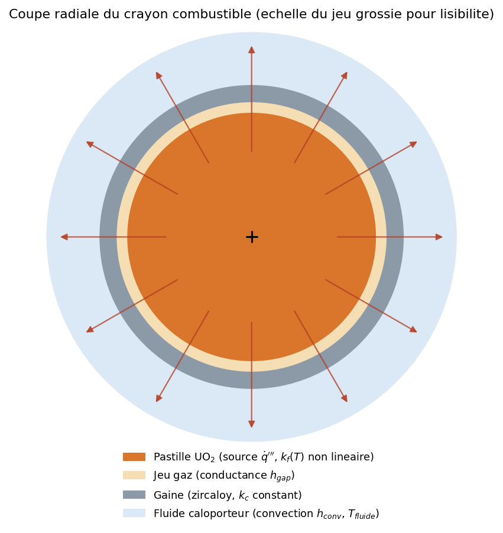
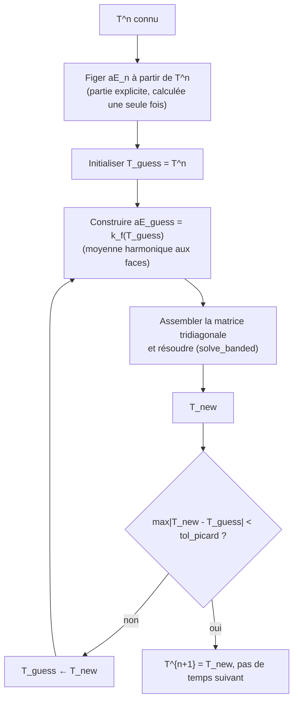
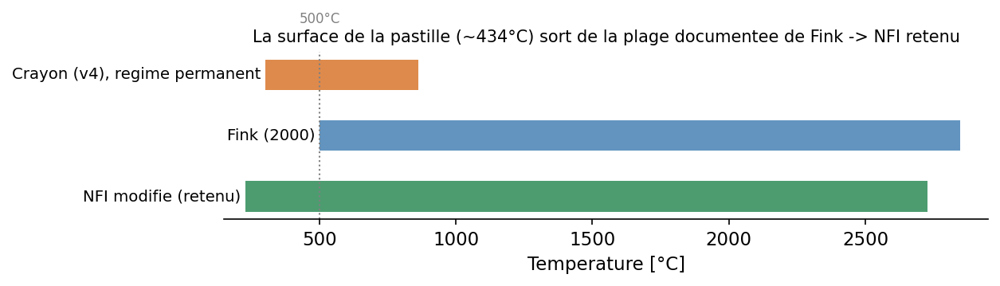
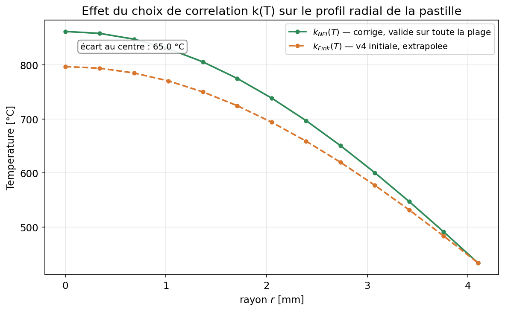
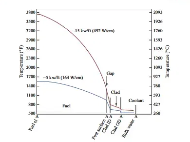
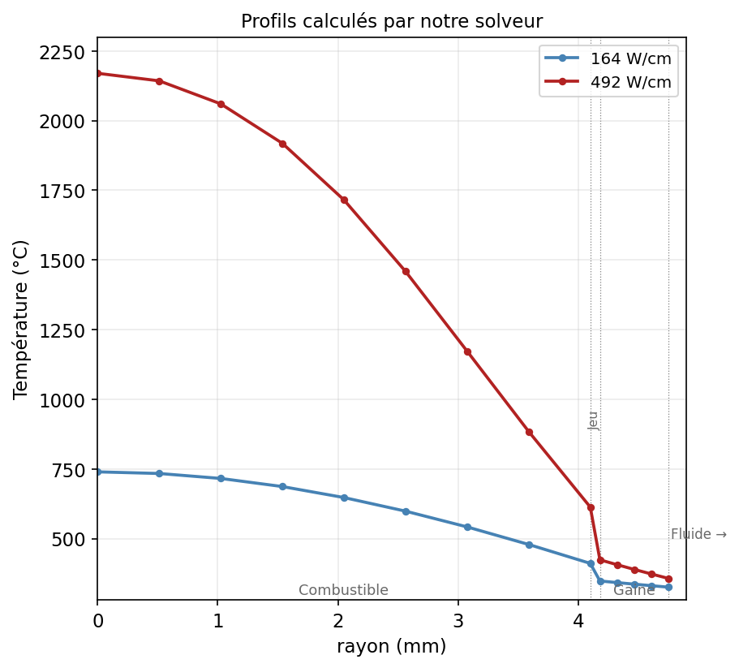

# Solveur thermique 1D radial d'un crayon combustible nucléaire : v4 (conductivité UO₂ non linéaire k(T))

**Généralisation du solveur avec une conductivité pastille k(T) non linéaire, et résolue par une boucle de point fixe (Picard) à chaque pas de temps.**

> Jusqu'en v3, la conductivité de l'UO₂ était supposée constante. En réalité elle **décroît** avec la température (de ~40 à ~50 % entre le centre et la surface de la pastille).
> La v4 intègre cette non-linéarité, valide la solution par une méthode analytique indépendante (transformation de Kirchhoff).

---

## Sommaire

1. [Présentation du problème](#1-présentation-du-problème)
2. [Hypothèses simplificatrices](#2-hypothèses-simplificatrices)
3. [Méthodologie du code](#3-méthodologie-du-code)
4. [Résultats](#4-résultats)
5. [Points critiques](#5-points-critiques)
6. [Tests](#6-tests)
7. [Conclusion](#7-conclusion)

---

## 1. Présentation du problème

On modélise la conduction radiale de la chaleur dans un crayon combustible, du centre de la pastille jusqu'au fluide caloporteur :

  

*Coupe radiale schématique : pastille UO₂ (source de fission, conductivité `k_f(T)` non linéaire), jeu gaz (conductance `h_gap`), gaine Zircaloy (conductivité `k_c` constante), puis convection en surface externe (`h_conv`, `T_fluide`).*

L'équation résolue est la diffusion de la chaleur en coordonnées cylindriques, en régime transitoire, avec une source dans la pastille uniquement :

$$\rho c_p \frac{\partial T}{\partial t} = \frac{1}{r}\frac{\partial}{\partial r}\left(r\,k(T)\,\frac{\partial T}{\partial r}\right) + \dot q'''(r)$$

Discrétisée par **volumes finis** sur un maillage radial nœud-centré, avec des conductances de face en moyenne harmonique entre matériaux/températures voisines, et intégrée en temps par un schéma implicite (Crank-Nicolson) jusqu'au régime permanent.

**Ce qui change en v4 par rapport à v1→v3** : `k_f` cesse d'être un scalaire et devient une fonction `k(T)`. Ce qui rend le système d'équations non linéaire et nécessite une boucle de résolution supplémentaire à chaque pas de temps (§3).

---

## 2. Hypothèses simplificatrices

| # | Hypothèse | Justification / limite assumée |
|---|---|---|
| 1 | Géométrie 1D radiale (symétrie axiale et azimutale) | Le crayon est traité comme une tranche 2D transversale, valable à n'importe quelle hauteur. On suppose que la chaleur ne circule que radialement (pas le long du crayon), et que la puissance générée est la même sur toute sa longueur. |
| 2 | `ρ·cp` de la pastille supposé **constant**, seule `k_f` varie avec `T` | Le code ne modélise la dépendance en température que pour la conductivité, pas pour la capacité thermique du combustible, qui varie aussi avec T dans la réalité. |
| 3 | Jeu pastille-gaine réduit à une conductance surfacique unique `h_gap` | Pas de résolution physique du gaz, ni de fermeture du jeu par gonflement du combustible. |
| 4 | Pas d'irradiation | Combustible traité comme neuf, sans irradiation. La dégradation de conductivité liée à l'usure en réacteur n'est pas modélisée. |
| 5 | `k_c` (gaine) constant | Le zircaloy n'est pas modélisé en fonction de la température. |
| 6 | Source `q̇'''` uniforme dans la pastille | La puissance générée par fission est supposée identique en tout point de la pastille. |
| 7 | Corrélation de conductivité valable uniquement sur une plage de température donnée | Vérifiée automatiquement à l'exécution. C'est ce contrôle qui a révélé une limite du modèle en v4 (voir §5). |

---

## 3. Méthodologie du code

**Maillage et volumes finis** : identiques à la v3 (un point de calcul au centre de chaque volume, des frontières à mi-distance entre points voisins, et des volumes en forme d'anneaux concentriques puisqu'on est en coordonnées cylindriques). Ce qui change, c'est l'assemblage de la matrice.

**Le problème à résoudre** : quand `k_f` dépend de `T`, la conductance de face `aE` (qui pilote la matrice tridiagonale) dépend elle-même de la solution `T` qu'on cherche ainsi le système n'est plus linéaire. La v4 résout ça par une **boucle de point fixe (Picard)** à chaque pas de temps :

**`_build_aE(T)`** reconstruit les conductances de la pastille à partir d'un jeu de températures, avec une conductance de face en moyenne harmonique entre nœuds voisins (cohérent avec une interface entre deux « matériaux » à température différente). La portion jeu+gaine reste fixe (calculée une seule fois).

**Explicite figé, implicite itéré.** La partie explicite du bilan (`aE_n`, à l'instant `n`) n'est calculée qu'une fois par pas de temps ; seule la partie implicite (`aE_guess`) est ré-évaluée à chaque itération de Picard.

**Validation par une méthode indépendante : transformation de Kirchhoff.** En régime permanent avec source uniforme, le changement de variable `Θ(T) = ∫ k(T') dT'` linéarise exactement l'équation de la pastille, quelle que soit la forme de `k(T)` :

$$\Theta(T(r)) - \Theta(T_{surf}) = \frac{\dot q'''}{4}\left(R_f^2 - r^2\right)$$

Le solveur numérique (Picard + volumes finis) est comparé point par point à cette solution semi-analytique (intégrée avec `scipy.integrate.quad`), pour Fink **et** pour NFI, sans aucune adaptation de la méthode entre les deux.

---

## 4. Résultats

**Les deux corrélations en jeu.** `k_uo2_fink` et `k_uo2_nfi` sont deux lois empiriques distinctes de conductivité de l'UO₂. Les deux partagent la **même structure mathématique**, la somme de deux termes physiquement distincts :

$$k(T) = \frac{1}{A + B\,T} \+\ \frac{C}{T^2}\exp\left(\frac{-D}{T}\right)$$

- **Premier terme, `1/(A + BT)`** : c'est celui qui compte vraiment pour ce crayon. Il représente la chaleur qui se propage de proche en proche dans le cristal d'UO₂,un peu comme une vibration qui se transmet d'atome en atome. Plus le matériau est chaud, plus ces vibrations s'agitent dans tous les sens et se gênent entre elles, ainsi la chaleur circule moins bien. C'est ce phénomène, qui explique pourquoi k diminue avec la température dans ce projet (§1).
- **Second terme, `(C/T²)·exp(-D/T)`** : celui-là ne se réveille que dans des conditions extrêmes, proches de la fusion de l'UO₂ (au-delà de 1600 °C). Il correspond à un autre mode de transport de la chaleur, cette fois porté par des électrons plutôt que par les vibrations du cristal, et lui, à l'inverse, augmente avec la température. Il n'a aucune influence sur ce crayon : sa plage de fonctionnement (300-1000 °C) reste bien trop basse pour que ce terme se manifeste.

Seuls les **coefficients** `A`, `B`, `C`, `D` diffèrent d'une corrélation à l'autre:

| Coefficient | Fink | NFI  |
|:---:|:---:|:---:|
| `A` | 0,0375 | 0,0452 |
| `B` | 2,165×10⁻⁴ | 2,46×10⁻⁴ |
| `C` | 4,715×10⁹ | 3,5×10⁹ |
| `D` | 16361 | 16361 |

| | **Fink** | **NFI**|
|---|---|---|
| Plage de validité documentée | 500-2847 °C | 227-2727 °C |
| Usage de référence | Corrélation UO₂ largement citée dans la littérature combustible | Modèle par défaut dans **FRAPCON-4.0**, code de performance combustible de référence |
| Termes burnup / gadolinium | N/A | La formule complète contient les termes α_gad, f(Bu) et g(Bu). Ces termes s'annulent par construction quand Bu = 0 et en l'absence de gadolinium. La formule réduite est donc exacte dans ce cas précis, pas une approximation (voir conditions d'usage ci-dessous). |

**Conditions d'usage que ces formules supposent, au-delà de la plage de température :**

- **`T` doit être fourni en Kelvin.** Le code convertit systématiquement la température (stockée en °C ailleurs dans le solveur) avant d'appeler ces fonctions. Une erreur d'unité ici fausserait complètement le résultat.
- **Combustible frais, sans gadolinium.** La formule complète de NFI inclut des termes correctifs en fonction du taux de combustion (`Bu`) et de la teneur en gadolinium (`α_gad`) ; Ici mis à zéro. Utiliser cette version réduite sur un combustible irradié ou gadolinié donnerait un résultat faux, pas juste imprécis.
- **UO₂ solide, pas de changement de phase.** Les deux corrélations décrivent la conduction dans le combustible solide ; elles ne couvrent ni la fusion de l'UO₂ (~2865 °C).

Les deux corrélations sont **indépendantes** mais décrivent la même grandeur physique. Leur proximité structurelle (même forme, coefficients du même ordre de grandeur) permet le test de cohérence croisée du §6 (`test_fink_et_nfi_coherents_dans_leur_zone_commune`), et c'est précisément parce que la plage documentée de Fink ne couvre pas la température réelle de ce crayon que NFI a été retenue (voir §5).

  

---

Cas de référence (conditions REP typiques) : `R_f = 4,1 mm`, `q̇''' = 3,8×10⁸ W/m³`, `T_fluide = 310 °C`, `h_gap = 10⁴ W/(m².K)`, `h_conv = 3,5×10⁴ W/(m².K)`.

  

*Profil radial recalculé avec la corrélation NFI, comparé au profil Fink initial. Les deux coïncident en surface par construction, et s'écartent progressivement vers le centre.*

| Grandeur | Valeur (NFI) |
|---|---|
| Température au centre | 862,0 °C |
| Température surface pastille | 433,6 °C |
| Bilan d'énergie (écart relatif générée/sortante) | ~10⁻¹³|

Le passage de Fink à NFI (voir §5) déplace la température centrale de **65 °C**.

**Validation externe.** Au-delà des vérifications internes (Kirchhoff, bilan d'énergie), le solveur est confronté à trois comparaisons indépendantes, construites à partir d'exercices et de données publiées dans un manuel de référence du domaine (*Nuclear Systems I*, Todreas & Kazimi) :
 
### A — Deux exercices non corrigés du manuel : le premier concernant la température maximale dans une pastille : 
 
Le manuel propose deux problèmes dont il n'imprime que la réponse finale, sans démarche ni solution détaillée. Le premier énoncé décrit une pastille pleine de 8,192 mm de diamètre, soumise à un flux de surface de 1,7 MW/m² et à une température de surface imposée à 400 °C. Il nous est demandé de déterminer la température maximale au sein d'une pastille pour deux lois de conductivité différentes :

 
| Cas | Loi `k` | Réponse du manuel | Notre solveur | Écart |
|---|---|---|---|---|
| 1 | constante, 3 W/(m·K) | 1560,5 °C | 1560,65 °C | 0,15 °C |
| 2 | exponentielle, `1 + 3·exp(-0,0005·T)` (T en °C) | 1627,8 °C | 1628,05 °C | 0,25 °C |

 
C'est la comparaison la plus concluante des trois : le cas 2 utilise une loi `k(T)` **exponentielle**, une forme mathématique totalement différente des corrélations Fink/NFI utilisées partout ailleurs dans ce projet. Un écart aussi faible (0,25 °C, de l'ordre de l'arrondi du manuel lui-même) prouve que la boucle de Picard et la transformation de Kirchhoff fonctionnent correctement pour n'importe quelle loi `k(T)`.
 
### B — Deuxième test externe portant sur la température moyenne, et non sur le centre
 
Le deuxième énoncé décrit un crayon PWR avec une pastille de 4,096 mm de rayon, une gaine de rayon interne 4,178 mm et de rayon externe 4,75 mm. Il fixe la température du fluide à 307,5 °C et le coefficient d'échange convectif à 28,4 kW/(m²·K). Il demande de calculer la puissance linéique maximale telle que la température moyenne pondérée en masse de la pastille ne dépasse pas 1204 °C (2200 °F). Le manuel fournit uniquement la réponse finale de 35,2 kW/m .

Le solveur calcule normalement la température à partir d'une puissance donnée ; ici, il fait l'inverse. Il teste plusieurs puissances jusqu'à trouver celle qui produit exactement la température moyenne cible, par dichotomie (scipy.optimize.brentq).

 
| | Réponse du manuel | Notre solveur | Écart |
|---|---|---|---|
| Puissance linéique max | 35,2 kW/m | 33,36 kW/m | −5,2 % |

 
### C — Lecture d'un graphique de référence
 
Le manuel propose un graphique classique du domaine, intitulé « Typical PWR fuel rod temperature profile ». Ce graphique trace la température du crayon, du centre de la pastille jusqu'au fluide caloporteur, pour deux puissances linéiques caractéristiques : 164 W/cm et 492 W/cm. Le solveur a recalculé ces deux mêmes profils, dans les mêmes conditions géométriques et thermiques.

Le résultat se lit en un coup d'œil. Les deux courbes racontent la même histoire : une chute progressive dans la pastille, une rupture nette au niveau du jeu, une gaine presque plate, puis un dernier saut vers le fluide. La silhouette générale colle parfaitement entre le manuel et le solveur. Seuls les chiffres précis divergent un peu, et c'est justement là que l'exercice devient intéressant.

 
<table>
<tr>
<td align="center" width="50%"><b>Manuel — Todreas & Kazimi, Fig. 8.22</b>  

</td>
<td align="center" width="50%"><b>Notre solveur, mêmes conditions</b>  

</td>
</tr>
</table>

| | 164 W/cm | 492 W/cm |
|---|---|---|
| T centre, lu sur le graphique du manuel | ≈ 871 °C | ≈ 2093 °C |
| T centre, notre solveur | 739,5 °C | 2169,8 °C |
| Écart | 15 % | 3,7 % |

 
L'écart plus marqué à 164 W/cm s'explique autrement. Un graphique généraliste comme celui du manuel se lit à l'œil, pas au pixel près. Ses hypothèses de conductance de jeu et de coefficient de convection ne sont d'ailleurs pas précisées dans le texte. Un peu d'imprécision de lecture, combinée à des hypothèses non documentées, suffit largement à expliquer un écart de cet ordre à basse puissance.
 

---

## 5. Points critiques

Ce que je sais être discutable dans ce modèle, et pourquoi :

- **La corrélation de Fink sortait silencieusement de sa plage de validité documentée.** La surface de la pastille de ce crayon (~434 °C = 707 K) est *sous* la borne basse de Fink (773 K) : le code utilisait une valeur extrapolée sans le signaler. Corrigé en deux temps, d'abord un garde-fou (`UserWarning` explicite dès que la température calculée sort de la plage, sans interrompre le calcul), puis un remplacement par le modèle NFI (utilisé par défaut dans FRAPCON-4.0, plage 227-2727 °C, qui couvre confortablement toute la plage réelle du crayon). Ce choix n'a nécessité de toucher ni à l'architecture du solveur ni à la méthode de validation (Kirchhoff), uniquement à la fonction de corrélation elle-même.
- **`ρ·cp` de la pastille est supposé constant** alors que `k_f(T)` varie. Découpler proprement les deux demanderait une loi `ρ·cp(T)` supplémentaire, non implémentée ici.
- **Pas de modélisation de l'irradiation** (`Bu = 0`) : Dans notre cas, le solveur ne couvre que le combustible frais.
- **Le jeu pastille-gaine reste un modèle simplifié hérité de v1-v3** : conductance surfacique fixe `h_gap`, pas de résolution physique de la conduction dans le gaz ni de fermeture du jeu par gonflement thermique.
- **`max_picard` et `tol_picard` sont des paramètres fixes**, pas de pas de temps adaptatif ni de relaxation en cas de non-convergence, c'est suffisant ici car la boucle converge en pratique en très peu d'itérations, mais ça ne reste pas robuste par construction à un cas fortement non linéaire ou mal initialisé.

---

## 6. Tests

Suite de tests (`pytest test_crayon_v4.py -v`), organisée en 5 blocs, tous verts :

| Bloc | Ce qu'il vérifie |
|---|---|
| Corrélation k_UO2(T) | 	La conductivité décroît strictement sur la plage de température du crayon (300-1000 °C). Elle reste dans une fourchette physiquement plausible (2-8 W/m/K). |
| Boucle de Picard | 	La boucle atteint toujours la convergence avant le plafond max_picard. Elle converge en moins de 5 itérations en moyenne, en régime quasi stationnaire. |
| Continuité avec les versions précédentes v3 | v3	Un k_f scalaire produit un résultat identique à celui de CrayonV3. La boucle converge en exactement 2 itérations lorsque k est constant. |
| Conservation / physique | Le bilan d'énergie vérifie qu'en régime permanent, la puissance générée dans la pastille et la puissance qui ressort par la surface coïncident. Un second test compare deux façons de calculer la température au centre. La première utilise la vraie loi k(T), qui décroît avec la température. La seconde utilise un k constant, fixé à la valeur qu'il aurait en surface. La température obtenue avec la vraie loi doit toujours être au moins aussi élevée que celle obtenue avec cette référence constante. Ce n'est pas une simple observation : la transformation de Kirchhoff permet de le démontrer mathématiquement. |
| Validation Kirchhoff | 	Le profil calculé coïncide, point par point, avec la solution semi-analytique, à 5 W/m près. Cette comparaison est menée aussi bien pour Fink que pour NFI. |
| Garde-fous de plage de validité | Un UserWarning se déclenche bien pour Fink à la température réelle du crayon (faux négatif évité). Aucun avertissement ne se déclenche pour un usage valide (faux positif évité). NFI n'émet aucun avertissement sur toute la plage du crayon. Fink et NFI restent cohérents dans leur zone de recouvrement, à moins de 30 % d'écart. |

---

## 7. Conclusion

La v4 étend le solveur à une conductivité non linéaire sans casser le comportement des versions précédentes. Avec un k constant, le résultat reste identique à celui de CrayonV3.

Le processus de vérification a lui-même trouvé un vrai défaut du modèle : la corrélation de Fink était utilisée en dehors de sa plage de validité. Ce défaut a été corrigé en deux temps, d'abord par un avertissement explicite, puis par le passage à la corrélation NFI, mieux adaptée à ce crayon.

La validation repose sur deux piliers : d'un côté, une méthode mathématique exacte, la transformation de Kirchhoff, valable pour n'importe quelle loi k(T). De l'autre, une confrontation à trois références externes indépendantes. Les écarts observés sont soit faibles, soit explicables par les hypothèses du modèle..

---
